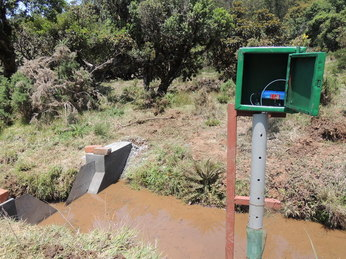

# Code documentation for discharge calculation

## Basic structure

Each logger has its own code for the sake of flexibility. This is not the most efficient way to organise things but it allows us to tweak components of the calculations as required by field conditions. Note: some stations call other station routines. This is because loggers have been moved/replaced over time. In some cases, flumes were placed in streams during low flows.

We refer to a staion as the location on the stream where the original water level recorder was placed. For example, station 107 in the grasslands above Upper Bhavani combines results from stn_107.R (original WLR) as well as stn_110.R (flume).

The control flow is as follows:
dis.control.R -> dis.function -> station wise routines

## [dis.control.R](dis.control.R)

Generate discharge for one minute intervals input: wlr no, start time, end time output: csv, figures.

### Variables to be entered by user

* Site: Nilgiris or Aghnashini
* Relative file names for scripts and data/outputs
* Start/end dates and time intervals for which discharge data is to be displayed (in months)
* Names of water level recorders to be processed.

### Other details

* Uses library timeSeries for time aggregation and ggplot2 for graphing.
* Calls function dis.plot to do the plotting.
* Gives warnings if there are duplicated timestamps - applicable where there is more than one logger. Uses function "mk.nullfile" to remove duplicates.

## [dis.functs.R](dis.functs.R)

Functions used by the control script reside here.

### calc.disch.areastage

Calculates discharge in m^3/s from a set of points describing a rating curve by using a non-linear least square fit. Original code by Jagdish Krishnaswamy. Steps involved:

* Read the stage-discharge point file.
* Read the processed water level recorder data, [documented here](../WLR/README.md)
* Run the NLS calculation:

> nls(Discharge~p1*(Stage)^p3,data=sd.fl, start=list(p1=3,p3=5))

Get coefficients p1 and p3 from above and calculate discharge as follows:

> Discharge <- p1 * (Stage)^p3

Inputs needed: input file name, input file name with complete root.

### calc.disch.flume

Calculates discharges  in m^3/s for a Montana flume based on the flume equation as per the constants provided for a 3" flume as below:

* Read in the processed WLR data.
* Constants are:
  * p1 <- 0.1771 (suggested by Shrinivas Badiger, note that web resources suggest 0.1765)
  * p3 <- 1.55
* Calculation is:
> Discharge <- p1*(Stage)^p3

Inputs needed: input file name, input file name with complete root.

### calc.disch.weir

Calculates the discharge in m^3/s for v-notch weirs. Note, this function does not work for compound weirs.

* Read in the processed WLR data
* Constants to be used are:
  * p1 <- 1.380278
  * p2 <- 2.5
* Calculation is:
> Discharge <- p1 * Stage^p2

Inputs needed: input file name, input file name with complete root.

### mk.nullfile

Tests for duplicate timestamps when a station has multiple loggers and suggests a null file to be created to avoid the problem. Requires manual copying of the suggested null file into the WLR/NULL/ folder.

Input needed: Duplicated timestamps, generated by [dis.control.R](./dis.control.R).

### dis.plot

Generates a discharge plot using ggplot2 and saves as a png file.

Input needed: formatted WLR data, generated by [dis.control.R](./dis.control.R).

## Code for different stations

### [stn_101.R](stn_101.R)

This station is a compound weir located just below *Kollari Betta*.

The catchment area under the weir is 293562.50 m^2, land cover is largely *Acacia mearnsii* with some *Eucalyptus globulus*. Upper reaches have grasslands and small Sheila patches.
Steps the script:

* Define constants:
  * Area of catchment
  * Type of catchment
  * File names, with and without parent directories
* Read in the one minute CSV file, ensure the timestamp is recognised as a date-time and set time zone to India
* Define parameters for equation:
  * Low stage - when water is flowing within the V portion of the weir
  * High stage - when it flows above the V
* Calculate discharge as:
  * For low stage:
  > Discharge <- 1.09*(1.393799*((Low Stage-0.2065)^2.5))
  * for high stage:
  > Discharge <- 1.09*((1.394*(((High Stage-0.2065)^2.5) - ((High Stage-0.603)^2.5))) + (0.719*(High Stage-0.603)^1.5))
* Bind the values together and sort by time stamp
* Round of discharge values to five digits
* Divide discharge by catchment area to get depth of discharge in metres. Multiply by 1000 to get depth of discharge in millimetres. 
