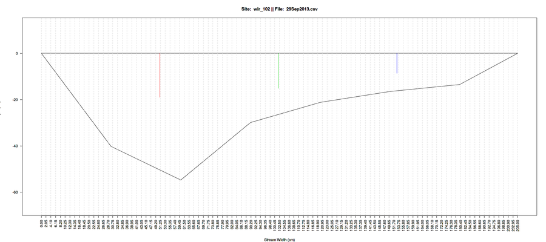

# Rating Curves

This collection of scripts creates a rating or stage/discharge curve based on three kinds of datasets:

1. Area/velocity measures using a pygmy current meter and a stream profile.
2. Salt dilution gauging using:
   1. Slug method and
   2. Constant release method.
3. Float or orange method.

Of these, we found estimates from the float and constant release method to give highly varying results between repeats and this data has been ignored. Also, field notes were used to finally de-select point which were outliers. This process has been documented in the datasets.

Sequence of scripts:

<<<<<<< Updated upstream
	"site.R" -> "useful.functs.R" -> "managefiles.R" -> "libs.R" -> "ExtractStage.R" -> "disch_pyg_figs.R" -> "pyg.R" -> "flt.R" -> "AppendSDG.R" -> "fig.R"
=======
	"site.R" -> "useful.functs.R" -> "managefiles.R" -> "libs.R" -> "ExtractStage.R" -> "rc_pyg_figs.R" -> "pyg.R" -> "flt.R" -> "AppendSDG.R" -> "fig.R"
>>>>>>> Stashed changes

## TODO

- [ ] @rsbhalla, Add the [Slug.R](../Discharge/Slug.R) script to the sequence of processing.

<<<<<<< Updated upstream
## [site.R](disch_nlg.R)
=======
## [site.R](rc_nlg.R)
>>>>>>> Stashed changes

This script sets the environment for the two sites; agh.R for Aghnashini and nlg.R for Nilgiris. It then calls the other routines and optionally cleans up the memory (code needs uncommenting).

### TODO:

- [ ] Sub-routines require naming to be shifted to the site.R code.
<<<<<<< Updated upstream
- [ ] Rename scripts, remove "disch_" prefix.
=======
- [ ] Rename scripts, remove "rc_" prefix.
>>>>>>> Stashed changes

## [useful.functs.R](useful.functs.R)

Functions used by the other routines to simplify procedures and reduce code size. Note, many code snippets are from <http://stackoverflow.com/> and other on-line resources. I've tried to attribute them but may have missed a few :grimacing:

### substrLeft/Right

Slight modification of the `substr` function allowing removal of "x" number of characters from a string.

### is.even/odd

Test to see if a numeric vector is even/odd.

### .ls.objects

From [this link](http://stackoverflow.com/questions/1358003/tricks-to-manage-the-available-memory-in-an-r-session), lists objects taking up most amount of memory. Used in conjunction with the `lsos` function which is shorthand for the `ls.objects` function. Follow link for more details.

### delfiles

Deletes the list of file names - works on the sub-folders of the `rating` directory.

### fixtime

Corrects goofs in date/time entries in the datasheets, specifically where time has been entered in the 24 hour format AND the AM/PM suffix is also used. Uses [this](http://stackoverflow.com/questions/2261079/how-to-trim-leading-and-trailing-whitespace-in-r) source for removing leading spaces.

### writeshape

Takes coordinates and file name to output a shapefile of the polygon representing the stream cross section. The output is to scale and allow the user to validate the area calculations via a GIS package such as Q-GIS.

TODO

- [ ] @rsbhalla, Consider adding function for importing and binding data files.
- [ ] @rsbhalla, Function for generating graphs to be added to cut down code in `fig.R`.
- [ ] @rsbhalla, Function for naming files/folders for input/output.

<<<<<<< Updated upstream
## [managefiles.R](disch_managefiles.R)
=======
## [managefiles.R](rc_managefiles.R)
>>>>>>> Stashed changes

Defines the folder/file names for the following:

* Location of types of data folders for pygmy current meters, float method data, stream profile data for pygmy meters, stream profile data for float method, folder where manual profiles (after checking) are saved, folder to hold (ESRI) shape files of the profile to make it easier to do area calculations for cross checking. Finally, names associated with the pygmy current meters for data output.
* List of folders under data types. Covers pygmy meters and floats.
* List all files contained in the various directories.
* List folder names to be deleted for post-script cleanup.
* List missing files between the velocity measures and cross section.

TODO

- [ ] @rsbhalla, Add file naming for salt dilution gauging.

<<<<<<< Updated upstream
## [libs.R](disch_libs.R)

Load the various libraries required to run the script.

## [ExtractStage.R](disch_ExtractStage.R)
=======
## [libs.R](rc_libs.R)

Load the various libraries required to run the script.

## [ExtractStage.R](rc_ExtractStage.R)
>>>>>>> Stashed changes

Extracts the stage for a water level recorder given the data and time of the stream profile and put in csv file and `R` object. Timestamps are read off the data sheets and matched with the outputs generated by the [WLR scripts.](../WLR/README.md)

## [pyg.figs.R](pyg.figs.R)

This script is to be run only if the cross sectional profiles have not been manually checked. The script simply assists in deciding the size of each cross sectional region for successive velocity profiles. It draws both the cross section of the stream and the locations at which the velocity meters were placed.

Based on these drawings, the user needs to create a new file under the folder 'cx_sec/wlr_XX' folder.
An example of one such file (based on the figure above) is:

secno | start | end | file_name
----- | ----- | --- | ---------
1 | 0 | 90 | 29Sep2013.csv
2 | 90 | 147.6 | 29Sep2013.csv
3 | 147.6 | 205 | 29Sep2013.csv

### Chunk 1

For each station folder (i.e. wlr_XXX):

* Create dataframes to hold temporary and final results.
* List file names for the `cx_pyg` and `pyg` folder.
* Print message that the respective file is being processed.

### Chunk 2

Plot the cross section by reading in the `cx_pyg` file, extracting coordinates and converting them into a polygon object. The output figure contains a grid with clear labels facilitating noting down of coordinates.

### Chunk 3

Read in data from the velocity measurements. Extract the coordinates of where the velocity meter was placed for each velocity reading. Plot this over the figure for stream cross section and write the figure to file.

### Chunk 4

Clean up temporary files and print completed message.

<<<<<<< Updated upstream
## [pyg.R](disch_pyg.R)
=======
## [pyg.R](rc_pyg.R)
>>>>>>> Stashed changes

This script processes the data for velocity area profiles, with velocity measurements by the pygmy current meters.

### Chunk 1

For each station folder (i.e. wlr_XXX):

* Print message with name of station being processed.
* Create dataframes to hold temporary as well as final results.

### Chunk 2

For each file contained in the station folder:

* Create lists of files from different types of folders. Note: the contents of file names in the velocity reading folder `pyg` must match those in the stream profile or cross section survey `cx_pyg`.
* Read in stream cross section coordinates from `cx_pyg`, plot them to a polygon object. Note this object does NOT contain the sections for velocity readings, just the overall profile.
* Read in processed WLR stage data from relevant csv file.
* Merge stage with velocity readings and save to a temporary file.

### Chunk 3

Initialise file names for dumping results in csv and image formats.

### Chunk 4

Calculate the average velocities of the cross sectional profiles. Warning: the script assumes that the number of profiles and velocity measure are the same, else an error is thrown. Also note: naming of columns is alpha numerical such as a6, b6, a2, a8, b2, b8 where 6 is 60% height, 2 is 20% and 8, 80% of height.

* Extract velocity measurements from the data file, dump into relevant column, e.g. vel6 for 60% height. 
* Write each velocity reading (should have 3 repeats each) per section to a temporary file, multiply by correction factor depending on the type of reading:
  * If at 0.6 height, average the three repeat readings.
  * If at 0.02 and 0.08 height, first average the two readings then average the repeats.
* Read in cross section data from the manually adjusted cross section `cx_sec` file and process data as such:
  * Calculate cross sectional area for each section of the stream.
  * Dump to a figure as well as a GIS shapefile.
* Merge velocity readings (averaged) with cross section dataset to get area/velocity readings for the different sections.
* Add the multiple velocity readings to get full area/velocity value.

### Chunk 5

Dump all results to figures and a csv files and optionally, remove all objects created by script.

### TODO

- [ ] @susan, Give details of model make.
- [ ] @saravanan. Provide data sheet and note on data organisation.
- [ ] @kumaran. Create EpiCollect based forms.

<<<<<<< Updated upstream
## [appendSDG.R](disch_appendSDG.R)

 The script merely take values for salt dilution gauging and bungs them onto the file containing stage-discharge values calculated from the pygmy meter results. Script to take in SDG data and process it is called Slug.R and resides in the Discharge folder.

## [fig.R](disch_fig.R)
=======
## [appendSDG.R](rc_appendSDG.R)

 The script merely take values for salt dilution gauging and bungs them onto the file containing stage-discharge values calculated from the pygmy meter results. Script to take in SDG data and process it is called Slug.R and resides in the Discharge folder.

## [fig.R](rc_fig.R)
>>>>>>> Stashed changes

Script calls ggplot2 to plot figures and dump CSV data as the final output of the rating curve. 

##[ AreaStgRln.R](AreaStgRln.R)

This is work in progress. The suggestion for the script came from Nick and Jagdish and it is to comprise of a number of tests to identify sources of errors in velocity area measurements:

1. Stage vs total profile area - cross-sectional area against stage in a particular interval where an interval is defined as between two successive downloads
2. Time versus Stage added to profile using a baseline profile and adding it to the base of the actual profile. The total area should be the same or very similar
3. Discharge versus area - unit area runoff. Should result in series of points sitting on top of one another.
4. Overlay profile polygons so that they are centered and overlayed.

At present the script plots successive files (three in a row) so that the timestamp on the data and the stage reading are plotted continuously. Each data file is plotted in a different colour to identify errors due to setting of the capacitance probes.

## [PlotCleanRatingCurves.R](PlotCleanRatingCurves.R)

This script plots the manually cleaned rating curves after visual assessment and cross checking the points against field notes. Most of the discarded points are due to poor velocity readings at very low streamflow. The input dataset includes justifications for rejecting points. The output of this script is both as a figure and as a CSV file, the data of is to be used for calculating the discharges.
