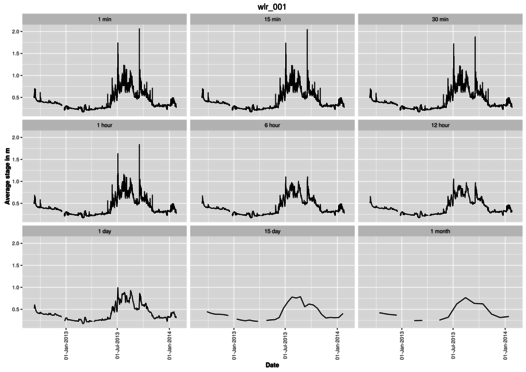

## Water Level Recorder (WLR) Scripts

This document summarises the scripts used to process the logs from capacitance based water level recorders from [Odyssey](http://odysseydatarecording.com/index.php?route=product/product&product_id=50). The logs are slapped together, calibrated and then agregated to stages from 1 minute to one month. Outputs are in the form of CSV files and a figure for each logger showing the different aggregations in panels.

Sub-routines are organised as follows:

	[site].R --> calib.R --> import.R --> null.R --> mergenull.R --> aggreg.R

## [site.r](wlr_agn.R)

Here [site] is to be replaced by "agn" for Aghnashini and "nlg" for Nilgiris - the two scripts are essentially the same and perform the following:

* Load the required libraries namely:
 * stringr) # to manipulate strings
 * timeSeries) # for aggregation
 * ggplot2) # for plotting
 * scales) ## for manipulating dates on ggplot2
* Set the file and folder paths
* List the ID's of the loggers to be processed - giving the user some control over the routine.
* Set the financial centre and time zone - a persistent hassle as some functions tend to set back the zone to GMT causing an offset of -5:30 hrs.
* Call the other sub-routines.

## [calib.R](wlr_calib.R)

This script calibrates the capacitance probes using a csv file of the capacitance readings at different depths and a linear regression.

A sample of the calibration file is as below. The file essentially comprises of a header containing logger identification numbers followed by length of the cable under water in metres and the capacitance reading (in farad?) for that length.

Site Name |WLR001
----------|------
Site Number |1
Logger |Capacitive Water Level
Logger Serial Number |43682
|
Length|Capacitance
0|2108.5
.20|2468
1.00|3917
2.00|5710.5

Once the calibration data is read for each unit, a linear regression is performed and the coefficient are dumped to a file while the plot of the data along with a regression line for intercept and slope is plotted in a panel for all the units.

## [import.R](wlr_import.R)

<<<<<<< Updated upstream
=======
1. Import dataset from the 'raw' folder and bind it.
2. Calibrate the capacitance to stage using the results of the [calib.R](wlr_calib.R) script.
3. Align loggers, particularly flumes or replacements at each station so that stage readings are consistent, i.e. jumps due to incorrect logger installation are removed.

Added support for multicores to improve speed. Multicore code from <http://stackoverflow.com/questions/1395309/how-to-make-r-use-all-processors>. However, need to spend time on changing the routines into functions and then use mclapply instead of loops.

# TODO

1. Scripts are painfully slow, loops need to be converted to functions. Code can be taken from the newer scripts such as those for processing the hygrochron data.

>>>>>>> Stashed changes

